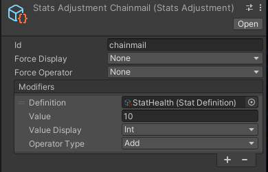
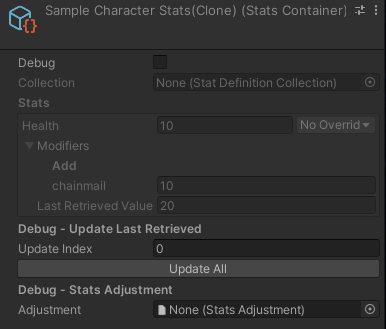

# Fluid Stats System

A Unity stats systems for JRPGs, action games, turn based, and any other genre you can think of. Create any kind of stats with visual editors and implement them however you want in your project. You can even bind stats changes to inventory items and effects with a "modifier" visual object. This Unity stats system is a package that can be easily included in any project with a few lines of code.


**Features**

* Create and manage stats data with visual editors
* Heavily optimized stat caching
* Curve support to handle character level ups and upgrades
* Quickly tweak and test stats adjustments in your games without additional programming (no more Excel Spreadsheets)
* Implementation agnostic. Does not rely on MonoBehavior classes (implement however you want)
* Bulk modify stats with stat modifiers. Visual objects that can be used for equipment, status effects, ect

**Support**

Join the [Discord Community](https://discord.gg/8QHFfzn) if you have questions or need help.

See upcoming features and development progress on the [Trello Board](https://trello.com/b/TFs6yUlR/fluid-stats).

## Quickstart

You'll need to [install](#installation) the package first before you can run any of the following. That said here is a quick rundown of how Fluid Stats works. Please note all of the following creation commands can be found by right clicking the project windows and going to **"Create -> Fluid -> Stats"**.

1. Create a settings object and place it in a "Resources" folder
1. Generate as many definitions as you want
1. Add the definitions to a definition collection
1. Create a container and attach the collection
1. Initialize the container with a code snippet like this

```c#
using CleverCrow.Fluid.StatsSystem;
using CleverCrow.Fluid.StatsSystem.StatsContainers;
using UnityEngine;

public class CharacterHealthStat : MonoBehaviour {
    public int playerLevel;
    public int health;
    public int attack;
    
    public StatsContainer originalStats;
    public StatsContainer runtimeStats;

    public int weaponLevel;
    public StatsAdjustment gearWeapon;
    
    private void Start () {
        // Generate a runtime copy that's safe to interact with
        runtimeStats = originalStats.CreateRuntimeCopy();

        // Write gear to the character's stats
        gearWeapon.ApplyAdjustment(runtimeStats, weaponLevel);

        // Retrieve the proper corresponding values and store them
        health = runtimeStats.GetStatInt("health", playerLevel);
        attack = runtimeStats.GetStatInt("attack", playerLevel);
    }
}
```

For a more in-depth explanation on Fluid Stats see the [guides](#getting-started-guides). They contain a complete walkthrough on creating your own stats from scratch with Fluid Stats.

### Installation

Fluid Stats is used through [Unity's Package Manager](https://docs.unity3d.com/Manual/CustomPackages.html). In order to use it you'll need to add the following lines to your `Packages/manifest.json` file. After that you'll be able to visually control what specific version of Fluid Stats you're using from the package manager window in Unity. This has to be done so your Unity editor can connect to NPM's package registry.

```json
{
  "scopedRegistries": [
    {
      "name": "NPM",
      "url": "https://registry.npmjs.org",
      "scopes": [
        "com.fluid"
      ]
    }
  ],
  "dependencies": {
    "com.fluid.stats": "1.1.1"
  }
}
```

## Table of Contents

* [Getting Started Guides](#getting-started-guides)
    + [Your First Health Bar](#your-first-health-bar)
    + [Your First Equipment Item](#your-first-equipment-item)
    + [Examples](#examples)
* [Recipes](#recipes)
    - [Using Stat Curves](#using-stat-curves)
    - [Printing Stats](#printing-stats)
    - [Event Subscriptions](#event-subscriptions)
    - [Adjusting Modifiers](#adjusting-modifiers)
    - [Order of Operations](#order-of-operations)
* [Releases](#releases)
* [Nightly Builds](#nightly-builds)
* [Development Environment](#development-environment)
    + [Making Commits](#making-commits)
    + [How To Contribute](#how-to-contribute)

## Getting Started Guides

### Your First Health Bar

Let's create a health bar that will display a players total health. Then reduce it when a button is clicked. This will walk you through the core fundamentals of how Fluid Stats works. When you're done you should be able to setup your remaining stats on your own.

#### Initial Setup

First off open up Unity and create a new project (2020 or newer recommended). Then run through the steps listed in the [installation](#installation). When you're done come back here.

With the package installed you'll need a StatsSettings object. This will prevent console errors and warnings.

1. Right click on the project window and go to "Create -> Fluid -> Stats -> Settings -> Default"
1. Keep the name and place it inside a "Resources" folder. Example `Resources/StatsSettings`

With settings taken care of we can now move onto creating your definition for the health stat.

#### Health Stat Definition

To get started you need to create a health definition that details how the health stat works. Definitions contain value types (int, float, int curve, float curve), how to handle modifiers (such as rounding), and other details.

Create your first definition with the details below. Then we'll adjust a few things to customize it.

1. Right click on the project window and go to "Create -> Fluid -> Stats -> Definitions -> Default"
1. Rename the created object "StatHealth" in the project window
1. Set an `id` of "health" so you can retrieve the value at runtime (more on that later)
1. Change the `value` to 10, which will alter the default value when this stat is created
1. Change the `displayName` to "Health"


With the definition complete you'll have to store it in a definition collection. We'll cover collections next.

#### Stat Collections

The health definition is useless unless we can attach it to a character. That's where definition collections come in. Think of collections as buckets of stats that can be shared throughout your game. For example characters might have a large number of combat stats while a door could just have health.

To add the health definition to a collection you'll need to create one. Then add the new health stat to it.

1. Right click on the project window and go to "Create -> Fluid -> Stats -> Definitions -> Collection"
1. Rename the created object "DefaultsStats"
1. Click the plus to add the health stat you just created


Keep in mind you can add as many stats as you want here (such as defense, magic, stamina, ect). Next you'll be placing the stat collection into a container.

#### Stats Containers

Stat containers are where all the stats for a character are stored. They allow you to tweak various stats or revert to defaults. Most importantly they compile your definition collections and handle runtime creation.

Containers are a great way share stats among multiple characters. For example you could create a stats container just for goblins and share it among goblin instances. Since containers are a ScriptableObject they avoid many of the serialization issues that come with prefabs.

Create your character stats container with the following instructions. Then attach the previously created collection.

1. Right click on the project window and select "Create -> Fluid -> Stats -> Container"
1. Rename the created object "SampleCharacterStats"
1. Attach the "DefaultStats" to the collection


With the container taken care of let's head back to the settings file. It can make maintaining stats on large projects much easier.

#### Stats Settings File

Remember that settings file we created at the beginning and placed in `Resources/StatsSettings`? It lets you override the stats shared among all containers. In short all stats added to the settings will appear on every character. Move your default stats to the settings so all created characters automatically get a health stat.

Set the default stats to your "DefaultsStats" object and remove the old reference.

1. In `Resources/StatsSettings` set the "Default Stats" to "DefaultStats"
1. Go back to "SampleCharacterStats" and remove the collection reference (stats will still persist)


With all your stats setup we can now move onto creating the health bar display.

#### The Health Bar

To create a health bar you'll need a canvas with a slider and a script that updates the screen when health changes. First off create the canvas and slider UI elements.

1. Create a new scene called "MyFirstHealthBar" and open it
1. Switch to 2D mode (in the scene panel near the top left)
1. Right click on the hierarchy window, then select "UI -> Canvas"
1. Select the canvas in the hierarchy, then select "UI -> Slider" 
    1. Place the slider inside the canvas object
    1. Set the slider "interactable" checkbox to false
1. Select the canvas again, then select "UI -> Button"
    1. Place the button inside the canvas object
    1. Align the button object so you can see it (might cover the slider)
    1. Change the button text to "Deal Damage"
    
When all the steps are complete your scene should look something like this.


Create a new script called `CharacterHealthStat`. This will tie together everything we've done so far and generate the runtime stats. It will also allow you to deal damage and affect the health bar when the game runs.

```c#
using CleverCrow.Fluid.StatsSystem.StatsContainers;
using UnityEngine;
using UnityEngine.UI;

public class CharacterHealthStat : MonoBehaviour {
    public Button buttonDealDamage;
    public Slider healthBar;

    public StatsContainer originalStats;
    public StatsContainer runtimeStats;

    private void Start () {
        // Generate a runtime copy that's safe to interact with
        runtimeStats = originalStats.CreateRuntimeCopy();

        // Generate the health bar
        var health = runtimeStats.GetStatInt("health");
        healthBar.maxValue = health;
        healthBar.value = health;

        // Bind our receive damage button
        buttonDealDamage.onClick.AddListener(ReceiveDamage);
    }

    private void ReceiveDamage () {
        healthBar.value -= 1;
    }
}
```

Lastly rig up the health bar to the new script. We're going to use the slider as a container for our health stats. Please note, you'd want to store the health information in something like this [stats gauge microframework](https://github.com/ashblue/unity-gauges) that handles min and max values. But for now we're just going to use the slider for ease of this tutorial.

1. Select the canvas object in the hierarchy
1. Attach the `CharacterHealthStat` script
    1. Set the `buttonDealDamage` to the button you previously created
    1. Set the `healthBar` to the slider you previously created
    1. Set the `originalStats` with "SampleCharacterStats" object. DO NOT add a `runtimeStats`, this field is automatically populated at runtime

And that's it. Run the game and click the button to reduce the bar's fill by 1. If you're having trouble you can always clone this repo and open the example scene `MyFirstHealthBar.scene` to cross compare.

### Your First Equipment Item

Building on the previous guide, let's create an equipment item that adjusts the total health with a gear piece. The "StatsAdjustment" object allows you to declare stats for modification with an operator (plus, minus, multiply, divide). These bundles can be bulk applied and removed by calling a simple method.

#### Creating The Item

For the item you'll need to create a `StatsAdjustment` object. Then assign it an ID and value to modify the health stat.

1. Right click on the project window and select "Create -> Fluid -> Stats -> Adjustment"
   1. Rename the created object "StatsAdjustmentChainmail"
1. Adjust the new object as so
    1. Set the 'id' to "chainmail"
    1. Click the plus on the modifiers and select StatHealth
    1. Set the modifier's `value` to 10



Now that you have a StatsAdjustment object it has to be applied to a runtime container. We'll do that next.

#### Equipping The Item

To equip the chainmail, you'll need to modify the `CharacterHealthStat.cs` script slightly. Add a field for the StatsAdjustment called `armor` and call `armor.ApplyAdjustment(runtimeStats)`. Place this logic in the `Start` method.

```c#
using CleverCrow.Fluid.StatsSystem;

// ...

public class CharacterHealthStat : MonoBehaviour {
    // ...

    public StatsAdjustment armor;

    private void Start () {
        runtimeStats = originalStats.CreateRuntimeCopy();
        
        // Equip the item before any calculations are run
        armor.ApplyAdjustment(runtimeStats);

        var health = runtimeStats.GetStatInt("health");
        healthBar.maxValue = health;
        healthBar.value = health;

        buttonDealDamage.onClick.AddListener(ReceiveDamage);
    }

    // ...
}
```

Add the chainmail to the `armor` field on the `Canvas` object. Then click the game to run it and everything should appear as normal.


Next we'll cover the stats debugger so you can see how the stats are being calculated for your chainmail.

#### Stats Debugger

To see the equipped stats double click the `runtimeStats` field on the Canvas object's `CharacterHealthStat` script while the game is running. This will give you a drill down of all modifiers and how they affect each stat. Note that if you did not include an ID on the modifier this would be a randomized unique ID for the name instead of `chainmail`.



All displayed stats are cached based on the last retrieved value. Complex calculations are run under the hood every time modifiers are applied or adjusted.

That's it, you've covered all the basics. For more in-depth details on how to use Fluid Stats see the [examples](#examples) or [recipes](#recipes) section.

### Examples

The following example projects are available to demonstrate advanced usage in a project.

* [Combat Example](Assets/Examples/CombatExample)
* [Inventory Equipment Example](Assets/Examples/InventoryEquipmentExample)

## Recipes

#### Using Stat Curves

Int and float curves can be used instead of hard numbers. This is useful if you want to base things on a character or equipment item's level.

```c#
var playerLevel = 10;
var runtimeStats = originalStats.CreateRuntimeCopy();
var health = runtimeStats.GetStatInt("health", 10);
```

#### Printing Stats

If you need to print all available stats from a `StatsContainer` you can loop over the records. In order to loop over them for printing do the following.

```c#
var runtimeStats = originalStats.CreateRuntimeCopy();
runtimeStats.records.records.ForEach(record => Debug.Log(record));
```

If you want to print out a `StatsAdjustment` instead do the following.

```c#
statsAdjustment.records.records.ForEach(record => Debug.Log(record));
```

#### Event Subscriptions

You can subscribe and unsubscribe to value change events on specific stats. This is very useful to avoid polling your stats for changes every frame.

```c#
var runtimeStats = originalStats.CreateRuntimeCopy();
var callback = new UnityAction<StatRecord>((record) => { Debug.Log(record); });

// To subscribe
runtimeStats.OnStatChangeSubscribe("health", callback);

// To unsubscribe if need be to prevent a memory leak
runtimeStats.OnStatChangeUnsubscribe("health", callback);
```

#### Adjusting Modifiers

Modifiers for stats can be applied with a StatsAdjustment's `ApplyAdjustment` method. They can also just be wiped with `RemoveAdjustment`.

```c#
var runtimeStats = originalStats.CreateRuntimeCopy();

// Applying a StatsAdjustment
statsAdjustment.ApplyAdjustment(runtimeStats);

// When done the adjustment can be removed in bulk as so
statsAdjustment.RemoveAdjustment(runtimeStats);
```

Adjustment stat modifiers can also be applied and removed individually as so.

```c#
var runtimeStats = originalStats.CreateRuntimeCopy();

runtimeStats.SetModifier(OperatorType.Add, "health", "modifier ID", 10);
runtimeStats.GetModifier(OperatorType.Add, "health", "modifier ID");
runtimeStats.RemoveModifier(OperatorType.Add, "health", "modifier ID");
```

Lastly you can wipe all modifiers on a stat with the following command.

```c#
runtimeStats.ClearAllModifiers("health");
```

#### Order of Operations

If you wish to override the order of operations you can create your own. Right click on the project window and go to "Create -> Fluid -> Stats -> Settings -> Order Of Operations".  The OrderOfOperations object must be set in the StatsSettings.orderOfOperations field in the Resources folder to work.


## Releases

Archives of specific versions and release notes are available on the [releases page](https://github.com/ashblue/fluid-stats/releases).

## Nightly Builds

To access nightly builds of the `develop` branch that are package manager friendly, you'll need to manually edit your `Packages/manifest.json` as so. 

```json
{
    "dependencies": {
      "com.fluid.stats": "https://github.com/ashblue/fluid-stats.git#nightly"
    }
}
```

Note that to get a newer nightly build you must delete this line and any related lock data in the manifest, let Unity rebuild, then add it back. As Unity locks the commit hash for Git urls as packages.

## Development Environment

If you wish to run the development environment you'll need to install the [Node.js](https://nodejs.org/en/) version in the [.nvmrc](.nvmrc) file. The easiest way to do this is install [NVM](https://github.com/nvm-sh/nvm) and run `nvm use`. 

Once you've installed Node.js, run the following from the root once.

`npm install`

If you wish to create a build run `npm run build` from the root and it will populate the `dist` folder.

### Making Commits

All commits should be made using [Commitizen](https://github.com/commitizen/cz-cli) (which is automatically installed when running `npm install`). Commits are automatically compiled to version numbers on release so this is very important. PRs that don't have Commitizen based commits will be rejected.

To make a commit type the following into a terminal from the root.

```bash
npm run commit
```

### How To Contribute

Please see the [CONTRIBUTIONS.md](./CONTRIBUTING.md) file for full details on how to contribute to this project.

---

This project was generated with [Oyster Package Generator](https://github.com/ashblue/oyster-package-generator).
