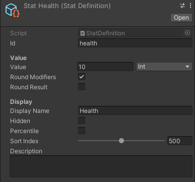

# Fluid Stats

A Unity stats systems for JRPGs, action games, turn based, and any other genre you can think of. Create any kind of stats with visual editors and implement them however you want in your project. You can even bind stats changes to inventory items and effects with a "modifier" visual object. This Unity stats system is a package that can be easily included in any project with a few lines of code.


**Features**

* Create all stats data with visual editors
* Heavily optimized stat caching
* Curve support to handle character level ups and upgrades
* Quickly tweak and test stats adjustments in your games without additional programming (no more Excel Spreadsheets)
* Implementation agnostic. Does not rely on MonoBehavior classes (implement however you want)
* Bulk modify stats with stat modifiers. Visual objects that can be used for equipment, status effects, ect.* Combine stats definitions with groups. Players, enemies, and physical objects can all share health, defense, ect. But have their own unique stats

**Support**

Join the [Discord Community](https://discord.gg/8QHFfzn) if you have questions or need help.

See upcoming features and development progress on the [Trello Board](https://trello.com/b/TFs6yUlR/fluid-stats).

## Quickstart

You'll need to [install](#installation) the package first before you can run any of the following. That said here is a quick rundown of how Fluid Stats works. Please note all of the creation commands can be found by right clicking the project windows and going to Create -> Fluid -> Stats.

1. Create a settings object and place it in a "Resources" folder
1. Generate as many definitions as you want
1. Add the definitions to a definition collection
1. Create a container and attach the collection
1. Initialize the container with a code snippet like this

```c#
using CleverCrow.Fluid.StatsSystem;
using CleverCrow.Fluid.StatsSystem.StatsContainers;
using UnityEngine;

public class CharacterHealthStat : MonoBehaviour {
    public int playerLevel;
    public int health;
    public int attack;
    
    public StatsContainer originalStats;
    public StatsContainer runtimeStats;

    public int weaponLevel;
    public StatsAdjustment gearWeapon;
    
    private void Start () {
        // Generate a runtime copy that's safe to interact with
        runtimeStats = originalStats.CreateRuntimeCopy();

        // Write gear to the character's stats
        gearWeapon.ApplyAdjustment(runtimeStats, weaponLevel);

        // Retrieve the proper corresponding values and store them
        health = runtimeStats.GetStatInt("health", playerLevel);
        attack = runtimeStats.GetStatInt("attack", playerLevel);
    }
}
```

For a more in-depth explanation on all the features Fluid Stats has to offer see the following guides. They contain an in-depth walkthrough on how to create a stats system from scratch. 

## Getting Started Guides

### Your First Health Bar

Let's create a health bar that will display a players total health. Then reduce it when a button is clicked. This will walk you through the core fundamental basics of how Fluid Stats works. When you're done you should be able to setup all of your stat buckets on your own.

Before we start, let's generate a settings object. This will prevent console errors and warnings.

1. Right click on the project window and go to "Create -> Fluid -> Stats -> Settings"
1. Keep the name and place it inside a "Resources" folder. Example `Resources/StatsSettings`

With settings taken care of we can now move onto stat definitions.

#### Health Stat Definition

To get started you need to create a health definition that details how the health stat works. Definitions contain value types (int, float, int curve, float curve), how to handle modifiers (such as rounding), and other details.

Create your first definition. Then we'll adjust a few things to customize it.

1. Right click on the project window and go to "Create -> Fluid -> Stats -> Definitions -> Default"
1. Rename the created object "StatHealth" in the project window
1. Set an `id` of "health" so you can retrieve the value at runtime (more on that later)
1. Change `value` to 10 which will alter the default value when this stat is initialized



With the definition complete you'll have to store it where it in a collection. We'll cover that in collections next.

#### Stat Collections

You need a way to attach the new health definition to a character. That's where definition collections come in. Think of collections as buckets of stats that can be shared throughout your game. For example characters might have a large number of combat stats while a door might only have health.

To add the health definition to a collection you'll need to create one. Then add the new health stat to it.

1. Right click on the project window and go to "Create -> Fluid -> Stats -> Definitions -> Collection"
1. Rename the created object "DefaultsStats"
1. Click the plus to add the health stat you just created


Keep in mind you can add as many stats as you want here (such as defense, magic, stamina, ect). Next you'll be placing the stat collection into a container.

#### Stats Containers

With the collection you're going to need a way to compile it into usable runtime data. That's where the stats container comes in. Containers manage and house all your collections and handle runtime creation.

Make your character stats container with the following instructions. Then attach the previously created collection.

1. Right click on the project window and going to "Create -> Fluid -> Stats -> Container"
1. Rename the created object "SampleCharacterStats"
1. Attach the "DefaultStats" to the collection


With the container taken care of let's head back to the settings file. It can make maintaining stats on large projects much easier.

#### Stats Settings File

Remember that settings file we created at the beginning and placed in `Resources/StatsSettings`? It let's us override the order of operations and default stats shared among all containers. That in mind, we can move our default stats to the settings so all created characters automatically get a health stat. Personally I often use this to have special customized data for different NPCs and player characters.

Set the default stats to our "DefaultsStats" object and remove the old reference.

1. In `Resources/StatsSettings` set the "Default Stats" to "DefaultStats"
1. Go back to "SampleCharacterStats" and remove the collection reference (stats will still persist)


#### The Health Bar

Now for the last part to rig up the health bar so we can see the health print to the screen. To do this we're going to create a canvas with a slider and write a script that outputs the health to the screen. First off create the canvas and slider UI elements.

1. Create a new scene called "MyFirstHealthBar" and open it
1. Right click on the hierarchy window, then select "UI -> Canvas"
1. Select the canvas in the hierarchy, then select "UI -> Slider" 
    1. Place the slider inside the canvas object
    1. Set the slider to non interactive
1. Select the canvas again, then select "UI -> Button"
    1. Change the button text to "Deal Damage"
    
When all the steps are complete your scene should look something like this.


Create a new script called `CharacterHealthStat`. This will tie together everything we've done so far and generate the runtime stats. It will also allow you to deal damage and affect the health bar when the game runs.

```c#
using CleverCrow.Fluid.StatsSystem.StatsContainers;
using UnityEngine;
using UnityEngine.UI;

public class CharacterHealthStat : MonoBehaviour {
    public Button buttonDealDamage;
    public Slider healthBar;

    public StatsContainer originalStats;
    public StatsContainer runtimeStats;

    private void Start () {
        // Generate a runtime copy that's safe to interact with
        runtimeStats = originalStats.CreateRuntimeCopy();

        // Generate the health bar
        var health = runtimeStats.GetStatInt("health");
        healthBar.maxValue = health;
        healthBar.value = health;

        // Bind our receive damage button
        buttonDealDamage.onClick.AddListener(ReceiveDamage);
    }

    private void ReceiveDamage () {
        healthBar.value -= 1;
    }
}

```

Lastly rig up the health bar to the new script. This is the last step.

1. Select the canvas object in the hierarchy
1. Attach the `CharacterHealthStat` script
    1. Set the `buttonDealDamage` to the button you previously created
    1. Set the `healthBar` to the slider you previously created
    1. Set the `originalStats` with "SampleCharacterStats" object. Do no add a `runtimeStats`, that will be automatically created for you at runtime

And that's it. Run the game and click the button to reduce the bar's fill by 1. If you're having trouble you can always clone this repo and open the `MyFirstHealthBar.scene` to double check things.

### Your First Equipment Item

Create the modifier object

Script to apply the modifier with a boolean

Instruct to inspect the debugger

### Examples

Direct to the two samples by cloning this repo

### StatsContainer API Commands

ASDF

### Order of Operations

If you wish to override the order of operations you can create your own.

HOW TO CREATE (include image)

### Installation

Fluid Stats is used through [Unity's Package Manager](https://docs.unity3d.com/Manual/CustomPackages.html). In order to use it you'll need to add the following lines to your `Packages/manifest.json` file. After that you'll be able to visually control what specific version of Fluid Stats you're using from the package manager window in Unity. This has to be done so your Unity editor can connect to NPM's package registry.

```json
{
  "scopedRegistries": [
    {
      "name": "NPM",
      "url": "https://registry.npmjs.org",
      "scopes": [
        "com.fluid"
      ]
    }
  ],
  "dependencies": {
    "com.fluid.stats": "1.0.0"
  }
}
```

## Releases

Archives of specific versions and release notes are available on the [releases page](https://github.com/ashblue/fluid-stats/releases).

## Nightly Builds

To access nightly builds of the `develop` branch that are package manager friendly, you'll need to manually edit your `Packages/manifest.json` as so. 

```json
{
    "dependencies": {
      "com.fluid.stats": "https://github.com/ashblue/fluid-stats.git#nightly"
    }
}
```

Note that to get a newer nightly build you must delete this line and any related lock data in the manifest, let Unity rebuild, then add it back. As Unity locks the commit hash for Git urls as packages.

## Development Environment

If you wish to run the development environment you'll need to install the [Node.js](https://nodejs.org/en/) version in the [.nvmrc](.nvmrc) file. The easiest way to do this is install [NVM](https://github.com/nvm-sh/nvm) and run `nvm use`. 

Once you've installed Node.js, run the following from the root once.

`npm install`

If you wish to create a build run `npm run build` from the root and it will populate the `dist` folder.

### Making Commits

All commits should be made using [Commitizen](https://github.com/commitizen/cz-cli) (which is automatically installed when running `npm install`). Commits are automatically compiled to version numbers on release so this is very important. PRs that don't have Commitizen based commits will be rejected.

To make a commit type the following into a terminal from the root.

```bash
npm run commit
```

### How To Contribute

Please see the [CONTRIBUTIONS.md](./CONTRIBUTING.md) file for full details on how to contribute to this project.

---

This project was generated with [Oyster Package Generator](https://github.com/ashblue/oyster-package-generator).
